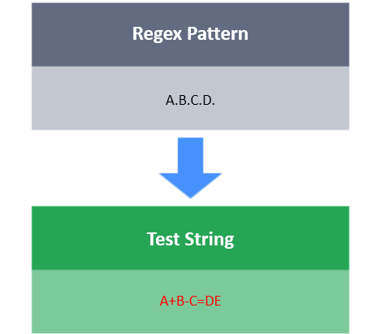

# Dot
The dot (`.`) matches anything (except for a newline).

Note: If you want to match (`.`) in the test string, you need to escape the dot by using a slash `\.`.
In Java, use `\\.` instead of `\.` .

**Task**

You have a test string **S**.
Your task is to write a regular expression that matches only and exactly strings of form: `abc.` `def.`
`ghi.` `jkx` where each variable `a, b, c , d, e, f, g, h, i, j, k, x`  can be any single character except the newline.

**Note**

This is a regex only challenge. You are not required to write any code.
You only have to fill in the regex pattern in the blank `(_________)`.