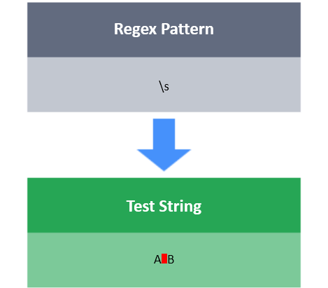

# Spaces \s

**\s** matches any whitespace character `[\r\n\t\f ]`.

**\S** matches any non-white space character.

**Task**

You have a test string S. Your task is to match the pattern `XXxXXxXX`
Here, **x** denotes whitespace characters, and **X** denotes non-white space characters.

