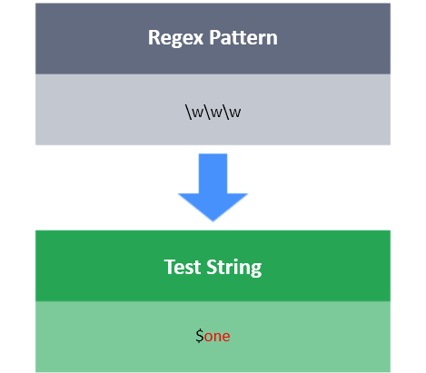
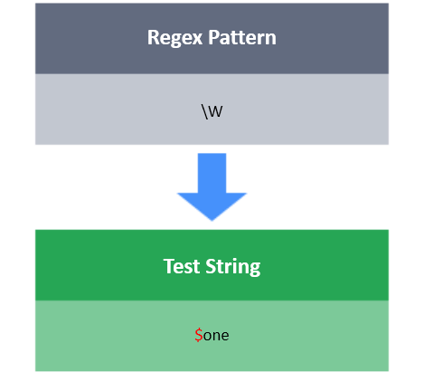

# Character 
**\w**

The expression \w will match any word character.
Word characters include alphanumeric characters `(a-zA-Z and 0-9) and underscore (_)`

**\W**

\W matches any non-word character.
Non-word characters include characters other than alphanumeric characters  `(a-zA-Z and 0-9) and underscore (_)`

**Task**

You have a test string S. Your task is to match the pattern `xxxXxxxxxxxxxxXxxx` Here **x** denotes any word character and **X** denotes any non-word character.
