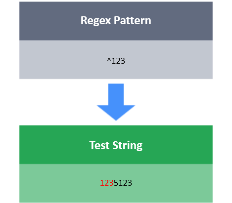
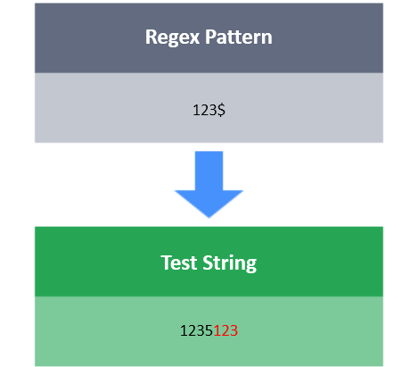

# Start ^ and End $ 

The **^** symbol matches the position at the start of a string.

The **$** symbol matches the position at the end of a string.

**Task**

You have a test string S. Your task is to match the pattern `Xxxxx.`
Here, x denotes a word character, and X denotes a digit.
S must start with a digit  and end with . symbol.
S should be  characters long only.

