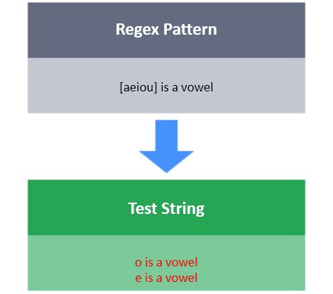

# []

The character class `[ ]` matches only one out of several characters placed inside the square brackets.

**Task**

You have a test string S.
Your task is to write a regex that will match  with following conditions:

- S must be of length: 6
- First character: 1, 2 or 3
- Second character: 1, 2 or 0
- Third character: x, s or 0
- Fourth character: 3, 0 , A or a
- Fifth character: x, s or u
- Sixth character: . or ,
