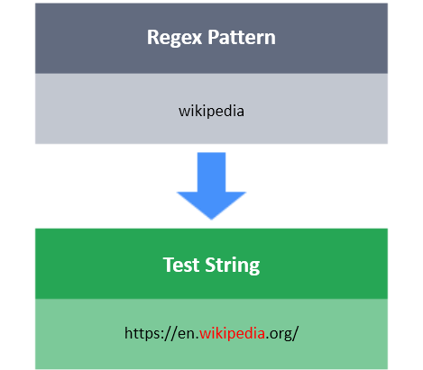

# Regular Expression (or RegEx)

A regular expression is a sequence of characters that define a search pattern. It is mainly used for string pattern matching.


Regular expressions are extremely useful in extracting information from text such as: code, log files, spreadsheets, documents, etc.

We can match a specific string `X` in a test string  `S`  by making our regex pattern `X` . This is one of the simplest patterns. However, in the coming challenges, we'll see how well we can match more complex patterns and learn about their syntax.

**Task**

You have a test string **S** . Your task is to match the string `hackerrank`. This is case sensitive.

**Input**

```
"The hackerrank team is on a mission to flatten the world by restructuring the 
DNA of every company on the planet. We rank programmers based on their coding skills, 
helping companies source great programmers and reduce the time to hire. 
As a result, we are revolutionizing the way companies discover and evaluate talented engineers. 
The hackerrank platform is the destination for the best engineers to hone their skills and 
companies to find top engineers."
```

**Output**

```
Number of matches : 2
```