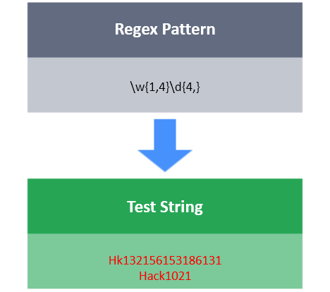

# {x, y}

The **{x,y}** tool will match between x and y (both inclusive) repetitions of character/character class/group.

**For Example:**

w{3,5} : It will match the character w 3, 4 or 5 times.
[xyz]{5,} : It will match the character x, y or z 5 or more times.
\d{1, 4} : It will match any digits 1, 2, 3, or 4 times.

**Task**

You have a test string S.

Your task is to write a regex that will match S using the following conditions:

-  S should begin with 1 or 2 digits.
- After that, S should have 3 or more `letters` (both lowercase and uppercase).
- Then S should end with up to  3. symbol(s). You can end with 0 to 3. symbol(s), inclusively.