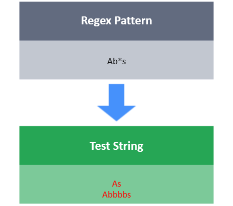

# *

The * tool will match zero or more repetitions of character/character class/group.

**For Example:**

w* : It will match the character w 0 or more times.
[xyz]* : It will match the characters x, y or z 0 or more times.
\d* : It will match any digit 0 or more times.

**Task**

You have a test string S.
Your task is to write a regex that will match S using the following conditions:

- should begin with 2 or more digits.
- After that, S should have 0 or more lowercase letters.
- should end with 0 or more uppercase letters
