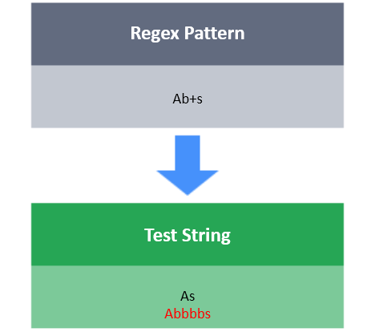

# +

The **+** tool will match one or more repetitions of character/character class/group.

**For Example:**

w+ : It will match the character w 1 or more times.
[xyz]+ : It will match the character x, y or z 1 or more times.
\d+ : It will match any digit 1 or more times.

**Task**

You have a test string s.
Your task is to write a regex that will match s using the following conditions:

- A should begin with 1 or more digits.
- After that, S should have 1 or more uppercase letters.
- S should end with 1 or more lowercase letters.

