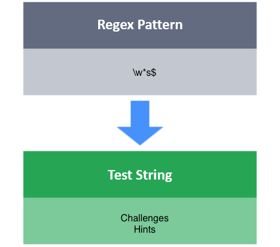

# $ - Matching Ending Items

The **$** boundary matcher matches an occurrence of a character/character class/group at the end of a line.

**Task**

Write a RegEx to match a test string, S, under the following conditions:

- S should consist of only lowercase and uppercase letters (no numbers or symbols).
- S should end in s.

