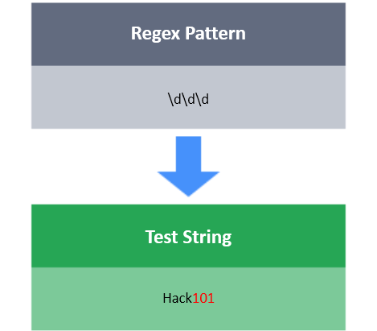
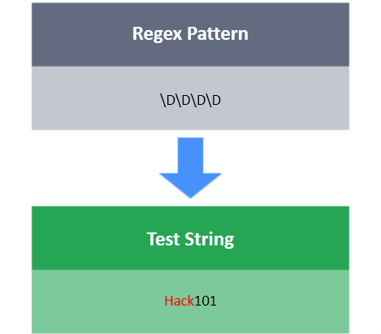

# Digit

The expression \d matches any digit **[0-9]**.

The expression \D matches any character that is not a digit.

**Task**

You have a test string **S**. Your task is to match the pattern: `xxXxxXxxxx`

Here x denotes a digit character, and X denotes a non-digit character.