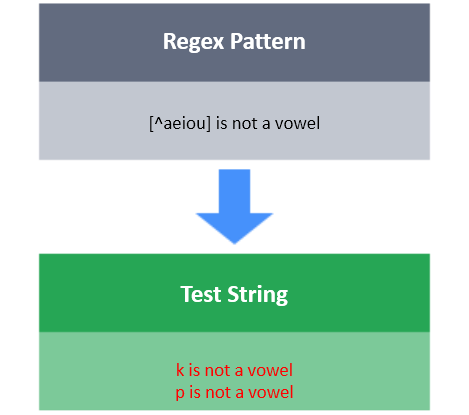

# [^]

The negated character class `[^]` matches any character that is not in the square brackets.

**Task**

You have a test string S.
Your task is to write a regex that will match S with the following conditions:
- S must be of length 6.
- First character should not be a digit (0-9).
- Second character should not be a lowercase vowel (aeiou).
- Third character should not be b, c, D or F.
- Fourth character should not be a whitespace character `\r, \n, \t, \f or <space>`.
- Fifth character should not be a uppercase vowel (AEIOU).
- Sixth character should not be a **.** or **,** symbol.
