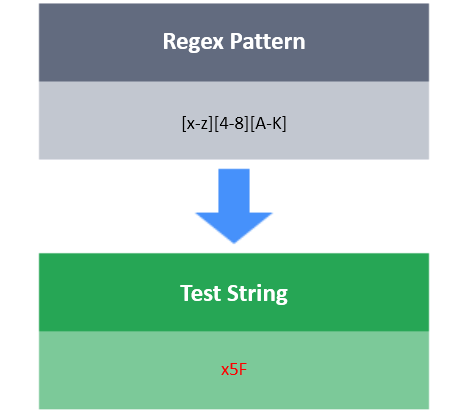

# Range Characters

In the context of a regular expression (RegEx), a character class is a set of characters enclosed within square brackets that allows you to match one character in the set.

A hyphen (-) inside a character class specifies a range of characters where the left and right operands are the respective lower and upper bounds of the range. For example:

- [a-z]  is the same as [abcdefghijklmnopqrstuvwxyz].
- [A-Z] is the same as [ABCDEFGHIJKLMNOPQRSTUVWXYZ].
- [0-9] is the same as [0123456789].

In addition, if you use a caret (^) as the first character inside a character class, it will match anything that is not in that range. For example, [^0-9] matches any character that is not a digit in the inclusive range from  to . It's important to note that, when used outside of (immediately preceding) a character or character class, the caret matches the first character in the string against that character or set of characters.

**Task**

Write a RegEx that will match a string satisfying the following conditions:

- The string's length is >= 5.
- The first character must be a lowercase English alphabetic character.
- The second character must be a positive digit. Note that we consider zero to be neither positive nor negative.
- The third character must not be a lowercase English alphabetic character.
- The fourth character must not be an uppercase English alphabetic character.
- The fifth character must be an uppercase English alphabetic character.
