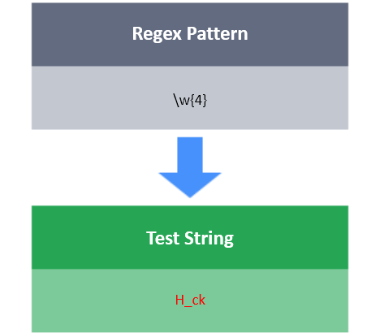

# {x}

The tool **{x}** will match exactly  repetitions of character/character class/groups.

**For Example:**

**w{3}** : It will match the character w exactly  times.

**[xyz]{5}** : It will match the string of length  consisting of characters {x, y, z}. For example it will match xxxxx, xxxyy and xyxyz.

**\d{4}** : It will match any digit exactly  times.

**Task**

You have a test string S.
Your task is to write a regex that will match S using the following conditions:

- S  must be of length equal to 45.
- The first 40 characters should consist of letters(both lowercase and uppercase), or of even digits.
- The last 5 characters should consist of odd digits or whitespace characters.